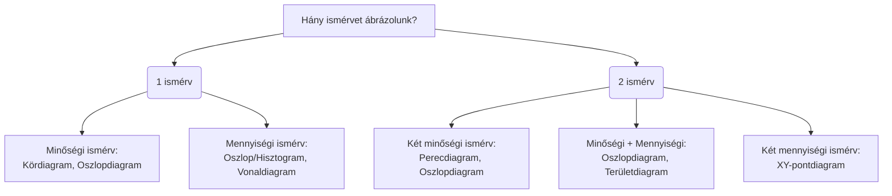

# Statisztika 1 – Alapfogalmak és viszonyszámok (Oktatási Jegyzet)

Ez a jegyzet a "P01 - Alapfogalmak, viszonyszámok.pdf" diái alapján készült, kiegészítve a 10. (20-as sorszámú) dián szereplő kézírásos jegyzetekkel. A könnyebb megértést segítő extra értelmezéseket és gyakorlati példákat (💡) külön kiemeltük.

---

## 0. A tárgy követelményei (Számonkérés)
A félévi jegy az alábbi pontokból tevődik össze:
*   Félévközi szóbeli: 30 pont (3 × 10).
*   Félévközi ZH: 60 pont (2 × 30).
*   Extra pontok (max. 10 pont): szemináriumi Socrative tesztek, szorgalmi beadandók, segédanyagok hibáinak jelzése.
*   **Ponthatárok:** 0-50 pont (elégtelen), 51-66 (elégséges), 67-76 (közepes), 77-86 (jó), 87-100 (jeles).

---

## 1. A statisztika tárgya és alapfogalmai

A statisztika a valóság tényeit tömören, számszerűen jellemezni, modellezni törekvő kettős tevékenység:
1.  **Gyakorlati tevékenység:** Információk gyűjtése, feldolgozása, elemzése és közzététele.
2.  **Tudományos módszertan:** A statisztikai tevékenység és következtetés elmélete.

### A három alapkérdés és fogalom
*   **Mit vizsgálunk?** $\rightarrow$ Sokaság (populáció).
*   **Mi alapján vizsgáljuk?** $\rightarrow$ Ismérv.
*   **Hogyan mérjük?** $\rightarrow$ Mérési skála.

### Az ismérvek rendszerezése
Az ismérv a sokaság egységeinek (egyedeinek) valamilyen jellemzője (pl. életkor, nem, részvény árfolyama). Az ismérv lehetséges kimeneteleit ismérv-változatoknak nevezzük.
*   **Alternatív ismérv:** Csak két lehetséges változata van (pl. nem).
*   **Változó:** Számszerű ismérv (ismérvérték).

**Ismérvek szerepe a sokaságban:**
*   **Közös ismérvek:** Ezek alapján egyformák az egyedek, ezek definiálják magát a sokaságot.
*   **Megkülönböztető ismérvek:** Ezek az eltérések, a statisztika ezeket vizsgálja és elemzi.

**Az ismérvek fajtái:**
1.  **Minőségi (kvalitatív):** Verbális jellemzés (pl. fényképezőgép márkája).
2.  **Mennyiségi (kvantitatív):** Számszerű jellemzés (pl. alapterület).
3.  **Területi:** Térbeli elhelyezkedés (pl. cég székhelye).
4.  **Időbeli:** Időbeli elhelyezkedés (pl. születési év).

---

## 2. Mérési skálák (A 10. dia kórházas példája alapján)

A nem mennyiségi ismérvek (és a minőségi kategóriák) változatai is kódolhatók számmá, de a kapott számértékekkel csak olyan műveletek végezhetők el, amelyek logikailag az eredeti változaton is értelmezhetők. 

*💡 Magyarázat: Bár adhatunk az 5. kerületnek egy "5-ös" kódot, vagy a férfiaknak "1"-est, a nőknek "0"-t, ezeket a számokat nem adhatjuk össze értelmesen (nincs értelme annak, hogy nő + férfi = férfi).*

### 2.1. Névleges (nominális) mérési skála
*   **Tulajdonság:** A számok/címkék csak azonosításra szolgálnak, pusztán azt tudjuk megállapítani velük, hogy két érték megegyezik-e vagy sem.
*   **Példa a diáról:** A betegek neve, lakóhely kerülete, vagy kódszámok (férfi=1, nő=0).
*   **Kézírásos kiegészítés:** Mindenféle azonosító ide tartozik.

### 2.2. Sorrendi (ordinális) mérési skála
*   **Tulajdonság:** A skálaértékek sorrendje hordoz információt (hierarchia van), de a köztük lévő távolság nem ismert vagy nem állandó.
*   **Példa a diáról:** Sürgősségi szint, helyezések.
*   **Kézírásos kiegészítés:** Versenyhelyezések, illetve filmek vagy szállodák értékelése.

### 2.3. Különbségi (intervallum) mérési skála
*   **Tulajdonság:** A skálaértékek különbségei információt hordoznak. Jellemzője, hogy a kezdőpont (nulla pont) önkényesen adott vagy konvención alapszik, nem jelenti a vizsgált tulajdonság teljes hiányát.
*   **Példa a diáról:** Kórterem emelete (a 3., 2., 1. emeletek közötti különbség egyenlő), hőmérséklet.
*   **Kézírásos kiegészítés:** A hőmérséklet, mert a 0 °C természetes nulla helyett mesterséges. (Ezért csak a különbség értelmezhető, arány nem: 20°C nem kétszer melegebb a 10°C-nál).

### 2.4. Arány (racionális) mérési skála
*   **Tulajdonság:** A legmagasabb szintű műveleti fok, ahol bármely két skálaérték egymáshoz viszonyított aránya egyértelműen meghatározható. Van természetes, abszolút nulla pontja.
*   **Példa a diáról:** Gyerek életkora, termelési érték.
*   **Kézírásos kiegészítés:** Fizikai jellemzők (magasság, súly). Itt kiszámítható, hogy valaki 1,5-szer idősebb.

---

## 3. Statisztikai adatok és pontosságuk

*   **Alapadat:** Mérés vagy számlálás útján szerzett, nem feltétlenül szám formájú információ.
*   **Leszármaztatott szám:** Az elemző munka során kiszámított érték (pl. viszonyszám, átlag, index).
*   **Mutatószám:** Szabványosított tartalmú, ismétlődően használt számszerű információ.

**Az adatok pontossága és hibaforrásai:**
A hibák származhatnak mintavételi hibából, vagy felvételi hibákból (pl. rossz definíció, téves válaszadás, feldolgozási hiba). 
Az adatpontosságot hibakorlátokkal írjuk le:
*   **Abszolút hibakorlát ($a$):** Megmutatja a mérés pontatlanságát a saját mértékegységében ($A \pm a$).
*   **Relatív hibakorlát ($\alpha$):** Százalékosan fejezi ki a hibát: $\alpha = a / A$.
*   *💡 Példa:* Ha a magyar népesség száma ezer főben kifejezve 9540, ez azt jelenti, hogy az adat $\pm 0,5$ ezer fő (azaz $\pm 500$ fő) abszolút pontosságú.

---

## 4. Statisztikai sorok és táblák

### Statisztikai sorok (Egydimenziós felsorolás)
Az adatok meghatározott összefüggés szerinti felsorolása.
1.  **Csoportosító sor:** A sokaság tagolása; egy sokaság részsokaságainak nagyságát mutatja be, általában az összesen sorral a végén (pl. Országok népessége külön-külön).
2.  **Összehasonlító sor:** A sokaság nagyságának térbeli vagy időbeli összehasonlítása, jellemzően összesítő sor nélkül (pl. Különböző országok népességének puszta egymás mellé állítása).
3.  **Leíró sor:** Több sokaságra vonatkozó; egyazon jelenséghez tartozó többféle (és gyakran eltérő mértékegységű) adat felsorakoztatása.

### Statisztikai táblák (Többdimenziós felsorolás)
Statisztikai sorok logikai összekapcsolásából jönnek létre. 
A **Kombinációs (vagy kontingencia) tábla** egy speciális típus, amelynél a sorok és az oszlopok is csoportosító sorok. *💡 Magyarázat: Ilyen, amikor nemcsak országonként bontjuk le a népességet, hanem a táblázat oszlopaiban a korcsoportokat (0-14, 15-64, 65+) is szerepeltetjük.*

---

## 5. Grafikus ábrázolás (Diagramok)

A vizualizáció típusát mindig az ismérvek **száma** és **típusa** határozza meg.

### Tipikus ábrázolási hibák és buktatók a diák alapján
1.  **A tengelymetszés torzítása:** Ha a függőleges (Y) tengelyt nem nullától indítjuk, egy minimális esés vizuálisan drasztikus zuhanásnak tűnhet.
2.  **Kör- és perecdiagramok összehasonlítása:** A kördiagram csak egyetlen sokaság belső arányainak érzékeltetésére jó. Két különböző év adatainak (pl. 2011 és 2016 lakásösszetételének) összehasonlítására a perecdiagram látványos, de rossz választás, mert az értékek abszolút nagyságát nem mutatja meg helyesen, a sugár gyökös területi változása miatt nehezen olvasható le az eltérés.
3.  **Vonaldiagram hamis "időtengellyel":** Ha az X tengelyen éveket ábrázolunk (pl. 1990, 2001, 2011, 2016), de a beosztás távolsága a diagramon egyenlő, az torzítja az átmenet meredekségét (a trendet). Ilyenkor vonaldiagram helyett szigorúan pont (XY) diagramot kell használni, ami kezeli a valós számszerű távolságokat.

### A Korfa érdekességei
*   **Szimmetria hiánya:** A férfi és női oldalak ritkán tökéletesen egyformák, ennek oka lehet biológiai (férfiak/nők eltérő halandósága) vagy történelmi (pl. a férfiak távolléte és halálozása az I. világháborúban).
*   **Demográfiai "nyomok":** A Ratkó-korszak (1949-1956) születésszám-növekedése (abortusztilalom, gyermektelenségi adó miatt) és a később születő Ratkó-unokák generációja (1974-1977) jól leolvasható dudorokat képeznek a korfán.

---

## 6. Viszonyszámok

A viszonyszám ($V$) két, egymással logikai kapcsolatban álló statisztikai adat hányadosa.  
*Képlete:* **$V = A / B$**  
Ahol az **$A$** a viszonyítás tárgya (a vizsgált adat), a **$B$** pedig a viszonyítás alapja (a bázis, amihez mérünk).

*💡 Magyarázat: A viszonyszámok értelmezése mindig azon múlik, hogy mi kerül a nevezőbe. Ha a kórházban meghalt férfiakat osztom az összes férfival, az a férfiak halálozási aránya. Ha a halott férfiakat osztom a halott nőkkel, az a nemek aránya a halottak közt. Két teljesen más mutató.*

### A viszonyszámok fajtái

**1. Megoszlási viszonyszám:**  
Egy részsokaságnak az *egészhez* (a fősokasághoz) viszonyított nagysága. Dimenzió nélküli, általában %-os formátumú.  
*Példa:* Nőtlenek száma / Összes ember száma.

**2. Összehasonlító viszonyszám:**  
A vizsgált érték egy bázisadathoz viszonyított hányada, dimenzió nélküli.
*   *Koordinációs:* Egy csoportosító sor két különböző elemének összevetése (Rész / Másik Rész). *Példa:* Nőtlenek / Házasok száma (100 nőtlenre 114 házas jut).
*   *Dinamikus:* Időbeli értékek összehasonlítása. *Példa:* 2022-es házasok száma / 1960-as házasok száma (a házasok száma a 0,66-szorosára csökkent).

**3. Intenzitási viszonyszám:**  
Egymással kapcsolatban álló, de *különböző* sokaságok adatainak aránya. Megmutatja, hogy az egyik sokaság egy egységére mennyi jut a másik sokaságból. Mértékegységgel rendelkezik (számláló/nevező formátumban).  
*Példa:* Összes hallgató száma / Összes oktató száma = 1 oktatóra jutó hallgatók száma.

### Figyelem: Százalék (%) vs. Százalékpont
Kritikus hiba lehet a mértékegységek (különösen a megoszlási arányok) téves összehasonlítása.  
Ha egy arány 40%-ról 60%-ra nő:
*   A különbségük: $60\% - 40\% = 20\%$ $\rightarrow$ Ez **20 százalékpontos** növekedés.
*   A viszonyszámuk: $60\% / 40\% = 1,5$ $\rightarrow$ Ez a bázishoz (40-hez) képest **50 százalékos** ($50\%$-os) növekedés.